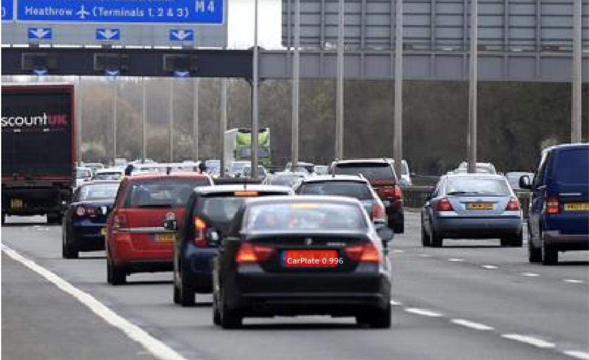

# Rapport de Projet : Détection de Plaques d'Immatriculation avec Mask R-CNN

## Noms des Étudiants

1. Rayan DANSOU : 323198885
2. Rayane SLIMANI : 32011741

## 1. Introduction

Dans le cadre de ce projet, nous avons utilisé un modèle Mask R-CNN pour détecter les plaques d'immatriculation de voitures. Ce modèle est basé sur le modèle pré-entraîné COCO, auquel nous avons adapté un entraînement pour notre jeu de données spécifique de plaques d'immatriculation.

## 2. Environnement et Préparation des Données

### a. Préparation du Dataset

Le dataset à beaucoup évolué au cours du projet. Dans un premier temps nous avons utilisé un dataset de 150 images collectées à partir de différentes sources d'images de plaques d'immatriculation.

- Répartition des images :

        Entraînement : 100 images
        Validation : 30 images
        Production : 20 images

Nous avons ensuite fait le choix de doubler nos images pour avoir plus de contenu durant l'entrainement, bien que les différentes étapes allais durer plus longtemps.
Un dataset de 300 images a donc été construit.

- Répartition des images :

        Entraînement : 225 images
        Validation : 50 images
        Production : 25 images

Ces images ont été annotées à l'aide de l'outil LabelMe pour marquer les plaques d'immatriculation.
Au début nous avons essayé d'être très précis et peut être même trop précis.


Lorsqu'il y'avait des plaques d'immatriculation avec des formes qui n'étaient pas rectangulaire nous faisions une annotations avec plus de 4 points.
Cela pouvais poser des problèmes par la suite car notre programme trouvais parfois des formes assez surprenantes dans nos images comme étant des plaques d'immatriculation.
C'est pour cela qu'à la fin nous avons repris toute les annotations pour avoir uniquement des annotations de 4 points et de forme rectangulaire.


### b. Hyperparamètres du Modèle pour l'Entraînement

Les hyperparamètres utilisés pour l'entraînement du modèle sont les suivants :

```
BACKBONE : resnet101
BACKBONE_STRIDES : [4, 8, 16, 32, 64]
BATCH_SIZE : 2
BBOX_STD_DEV : [0.1, 0.1, 0.2, 0.2]
COMPUTE_BACKBONE_SHAPE : None
DETECTION_MAX_INSTANCES : 100
DETECTION_MIN_CONFIDENCE : 0.9
DETECTION_NMS_THRESHOLD : 0.3
FPN_CLASSIF_FC_LAYERS_SIZE : 1024
GPU_COUNT : 2
GRADIENT_CLIP_NORM : 5.0
IMAGES_PER_GPU : 1
IMAGE_CHANNEL_COUNT : 3
IMAGE_MAX_DIM : 1024
IMAGE_META_SIZE : 14
IMAGE_MIN_DIM : 800
IMAGE_MIN_SCALE : 0
IMAGE_RESIZE_MODE : square
IMAGE_SHAPE : [1024, 1024, 3]
LEARNING_MOMENTUM : 0.9
LEARNING_RATE : 0.001
LOSS_WEIGHTS : {'rpn_class_loss': 1.0, 'rpn_bbox_loss': 1.0, 'mrcnn_class_loss': 1.0, 'mrcnn_bbox_loss': 1.0, 'mrcnn_mask_loss': 1.0}
MASK_POOL_SIZE : 14
MASK_SHAPE : [28, 28]
MAX_GT_INSTANCES : 100
MEAN_PIXEL : [123.7, 116.8, 103.9]
MINI_MASK_SHAPE : (56, 56)
NAME : custom
NUM_CLASSES : 2
POOL_SIZE : 7
POST_NMS_ROIS_INFERENCE : 1000
POST_NMS_ROIS_TRAINING : 2000
PRE_NMS_LIMIT : 6000
ROI_POSITIVE_RATIO : 0.33
RPN_ANCHOR_RATIOS : [0.5, 1, 2]
RPN_ANCHOR_SCALES : (32, 64, 128, 256, 512)
RPN_ANCHOR_STRIDE : 1
RPN_BBOX_STD_DEV : [0.1, 0.1, 0.2, 0.2]
RPN_NMS_THRESHOLD : 0.7
RPN_TRAIN_ANCHORS_PER_IMAGE : 256
STEPS_PER_EPOCH : 100
TOP_DOWN_PYRAMID_SIZE : 256
TRAIN_BN : False
TRAIN_ROIS_PER_IMAGE : 200
USE_MINI_MASK : True
USE_RPN_ROIS : True
VALIDATION_STEPS : 50
WEIGHT_DECAY : 0.0001
```

## 3. Résultats de l'Entraînement

### a. Fichier Log d'Entraînement

Le fichier de log d'entraînement suit les itérations et les différentes pertes (loss) à chaque époque. La dernière ligne du fichier log montre les pertes finales après l'entraînement.

Extrait de log (dernière ligne) :

Epoch 20/20

````
loss: 0.2353 - rpn_class_loss: 0.0038 - rpn_bbox_loss: 0.0774 - mrcnn_class_loss: 0.0112 - mrcnn_bbox_loss: 0.0443 - mrcnn_mask_loss: 0.0985 - val_loss: 0.6115 - val_rpn_class_loss: 0.0032 - val_rpn_bbox_loss: 0.2181 - val_mrcnn_class_loss: 0.0287 - val_mrcnn_bbox_loss: 0.1614 - val_mrcnn_mask_loss: 0.2001 
````

Pour des logs plus détaillés, voir le fichier logs.txt.

### b. Matrice de Confusion

La matrice de confusion suivante montre les performances du modèle sur le jeu de validation :


### c. Graphique des Pertes d'Entraînement et de Validation

Le graphique ci-dessous illustre l'évolution des pertes d'entraînement (variables loss et val_loss) et de validation pendant les 20 épochs.


### d. Démonstration du modèle




### e. Commentaires

Le modèle montre une bonne évolution des pertes d'entrainement. Cependant, les métriques de validation indiquent que le modèle n'est pas encore capable de détecter correctement la plupart des plaques d'immatriculation dans le jeu de validation (val_loss à 0,6).Du fine tuning pourra donc être nécessaire pour réduire les faux positifs et les faux négatifs restants.


## 4. Fine-tuning

### a. Modification des paramètres pour l'amélioration du modèle

Pour le fine-tuning du modèle, nous avons complété l'entrainement du modèle avec 5 epochs. Les paramètres suivants ont été utilisés pour améliorer les performances :

````
BACKBONE                       resnet50
BACKBONE_STRIDES               [4, 8, 16, 32, 64]
BATCH_SIZE                     2
BBOX_STD_DEV                   [0.1 0.1 0.2 0.2]
COMPUTE_BACKBONE_SHAPE         None
DETECTION_MAX_INSTANCES        100
DETECTION_MIN_CONFIDENCE       0.95
DETECTION_NMS_THRESHOLD        0.3
FPN_CLASSIF_FC_LAYERS_SIZE     1024
GPU_COUNT                      2
GRADIENT_CLIP_NORM             5.0
IMAGES_PER_GPU                 1
IMAGE_CHANNEL_COUNT            3
IMAGE_MAX_DIM                  1024
IMAGE_META_SIZE                14
IMAGE_MIN_DIM                  800
IMAGE_MIN_SCALE                0
IMAGE_RESIZE_MODE              square
IMAGE_SHAPE                    [1024 1024    3]
LEARNING_MOMENTUM              0.9
LEARNING_RATE                  0.001
LOSS_WEIGHTS                   {'rpn_class_loss': 1.0, 'rpn_bbox_loss': 1.0, 'mrcnn_class_loss': 1.0, 'mrcnn_bbox_loss': 1.0, 'mrcnn_mask_loss': 1.0}
MASK_POOL_SIZE                 14
MASK_SHAPE                     [28, 28]
MAX_GT_INSTANCES               100
MEAN_PIXEL                     [123.7 116.8 103.9]
MINI_MASK_SHAPE                (56, 56)
NAME                           custom
NUM_CLASSES                    2
POOL_SIZE                      7
POST_NMS_ROIS_INFERENCE        1000
POST_NMS_ROIS_TRAINING         2000
PRE_NMS_LIMIT                  6000
ROI_POSITIVE_RATIO             0.33
RPN_ANCHOR_RATIOS              [0.5, 1, 2]
RPN_ANCHOR_SCALES              (32, 64, 128, 256, 512)
RPN_ANCHOR_STRIDE              1
RPN_BBOX_STD_DEV               [0.1 0.1 0.2 0.2]
RPN_NMS_THRESHOLD              0.7
RPN_TRAIN_ANCHORS_PER_IMAGE    256
STEPS_PER_EPOCH                100
TOP_DOWN_PYRAMID_SIZE          256
TRAIN_BN                       False
TRAIN_ROIS_PER_IMAGE           200
USE_MINI_MASK                  True
USE_RPN_ROIS                   True
VALIDATION_STEPS               100
WEIGHT_DECAY                   0.0001
````

##### modifications apportées

- BACKBONE -> resnet50: nous avons modifié le backbone opur améliorer la vtesse d'entrainement du modèle.
- VALIDATION_STEPS -> 100 : en passant les Validation steps à 100 on peut s'assurer que le modèle ne fait pas d'overfitting
- DETECTION_MIN_CONFIDENCE -> 0.95 : On augmente le taux de confiance minium pouyr améliorer la fiabilité du modèle

#### b. résultat de l'entrainement

Epoch 25/25

````
loss: 0.4274 - rpn_class_loss: 0.0086 - rpn_bbox_loss: 0.1550 - mrcnn_class_loss: 0.0247 - mrcnn_bbox_loss: 0.1026 - mrcnn_mask_loss: 0.1365 - val_loss: 0.6439 - val_rpn_class_loss: 0.0176 - val_rpn_bbox_loss: 0.2313 - val_mrcnn_class_loss: 0.0385 - val_mrcnn_bbox_loss: 0.1614 - val_mrcnn_mask_loss: 0.1952
````

### c. graphe des pertes 


### d. Commentaire

Depuis l'epoch 20,  Nous avons dans un premier temps eu un pique dans les pertes (à cause de l'introduction de nouveaux hyperparamètres), puis une stabilisation. Cependant à la fin de l'entrainement avec les nouveau hyperpramètres, on peut remarquer que les pertes sont plus élevées qu'a l'époch 20. Le modèle pourrait être entrain de faire de l'overfitting notamment à cause des pertes de validations qui se dégradent encore plus qu'avant.

On peux également remarquer que très rarement le modèle reconnait des adresses (eg. www.google.com) ,qui peuvent se trouver sur les images, comme étant des plaque d'immatriculation. 
Cela est en partie dû au fait que pendant les annotations, on a pris entièrement les plaques d'immatriculation, avec les petits détails qui se trouvaient dessus (comme par exemple des adresse web).
On aurait pu faire le choix de restraindre manuellement nos annotations et de ne prendre que le contenu qui nous intéresse, c'est à dire, la partie de la plaque d'immatriculation contenant les chiffres et lettres de celle-ci.

### e. résultats du modèle 


